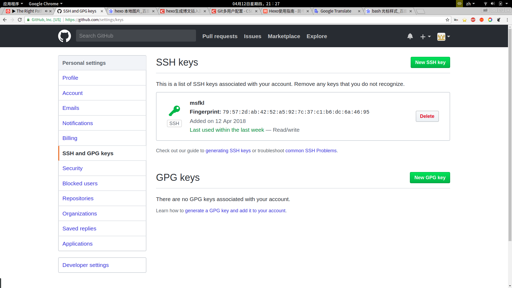

*recently, I want to use my pc's git to manage two github account. so after search a lot, I find a way to accomplish it*  

If you never use git, maybe you should just google how to use it. It's a very powerful tool.  
Since I have used it, so my .ssh folder has `id_rsa` and `id_rsa.pub` file. That is the ssh key between my pc's git and github.  
In order to manage two github account. The first thing I have to is create two different ssh keys.  

```shell
$ cd .ssh&&ls .ssh
id_rsa.pub  id_rsa  ssh_auth_sock

$ mv id_rsa.pub id_rsa_A.pub  			//first ssh key 
$ mv id_rsa id_rsa_A

$ ssh-keygen -t rsa -C "your email"		//you should specify ssh key name 
under the command's output information

$ ls .ssh							//the final result
id_rsa_A.pub  id_rsa_A  ssh_auth_sock
id_rsa_B.pub id_rsa_B

```

Then add ssh key to `ssh agen`  
```shell
$ ssh-add ~/.ssh/id_rsa_A
$ ssh-add ~/.ssh/id_rsa_B

```
The next step is copy two ssh key(id_rsa_A and id_rsa_b content) to github account.  

  

Then edit `config` file(if non-exist, create it) under .ssh folder. add following content. The most important is Host and IdentityFile.  

```
# configuration 1  
# Host github.com      
Host A.com  
# HostName 服务器ip地址或机器名  
HostName github.com  
# User连接服务器的用户名  
User A  
# IdentityFile 密匙文件的具体路径  
IdentityFile ~/.ssh/id_rsa_A
  
  
# configuration 2 
# Host 服务器别名  
Host B.com  
# HostName 服务器ip地址或机器名  
HostName github.com  
# User连接服务器的用户名  
User B  
# IdentityFile 密匙文件的具体路径  
IdentityFile ~/.ssh/id_rsa_B

```
Ok, test them!
```shell
$ ssh -T git@A.com
Hi ***! You've successfully authenticated, but GitHub does not provide shell access.
$ ssh -T git@B.com
Hi ***! You've successfully authenticated, but GitHub does not provide shell access.
```
No problem!  

NOTE! when you copy such as ` git@github.com:A/A.github.io.git `. you should change it to ` git@A.com:A/A.github.io.git ` . then ` git remote add ` to you dictionary. Then ` push ` is ok. 


